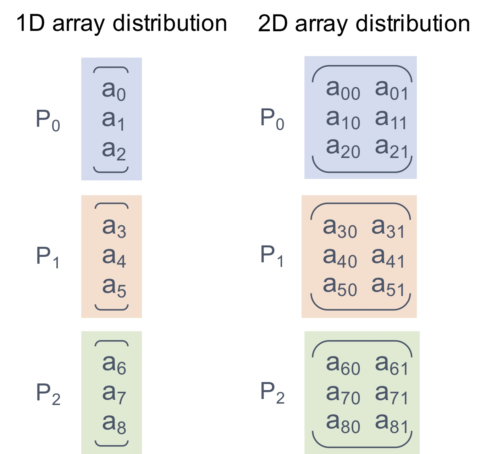

.. _UserGuide:

User Reference
~~~~~~~~~~~~~~

Quick Introduction to HPAT
==========================

.. todo::
   Update the content for this section
 
High Performance Analytics Toolkit (HPAT) is a big data analytics and machine
learning framework that provides Python's ease of use but is extremely fast.

HPAT scales analytics programs in python to cluster/cloud environments
automatically, requiring only minimal code changes. Here is a logistic
regression program using HPAT::

    @hpat.jit
    def logistic_regression(iterations):
        f = h5py.File("lr.hdf5", "r")
        X = f['points'][:]
        Y = f['responses'][:]
        D = X.shape[1]
        w = np.random.ranf(D)
        t1 = time.time()
        for i in range(iterations):
            z = ((1.0 / (1.0 + np.exp(-Y * np.dot(X, w))) - 1.0) * Y)
            w -= np.dot(z, X)
        return w

This code runs on cluster and cloud environments using a simple command like::

    mpiexec -n 1024 python logistic_regression.py

HPAT compiles the source code to efficient native parallel code
(with `MPI <https://en.wikipedia.org/wiki/Message_Passing_Interface>`_).
This is in contrast to other frameworks such as Apache Spark which are
master-executor libraries. Hence, HPAT is typically 100x or more faster.
HPAT is built on top of `Numba <http://numba.pydata.org/numba-doc/latest/index.html>`_
and `LLVM <https://llvm.org/>`_ compilers.

How to Install HPAT
====================

.. todo::
   Update the instructions in this section

HPAT can be installed in `Anaconda <https://www.anaconda.com/download/>`_ environment
easily. On Linux/Mac/Windows::

    conda create -n HPAT -c ehsantn -c anaconda -c conda-forge hpat

.. used if master of Numba is needed for latest hpat package
.. conda create -n HPAT -c ehsantn -c numba/label/dev -c anaconda -c conda-forge hpat

Building from Source on Linux
-----------------------------

We use `Anaconda <https://www.anaconda.com/download/>`_ distribution of
Python for setting up HPAT.

Miniconda3 is required for build::

    wget https://repo.continuum.io/miniconda/Miniconda3-latest-Linux-x86_64.sh -O miniconda.sh
    chmod +x miniconda.sh
    ./miniconda.sh -b
    export PATH=$HOME/miniconda3/bin:$PATH

It is possible to build HPAT via conda-build or setuptools. Follow one of the cases below to install HPAT and its dependencies
such as Numba on Ubuntu Linux.

Build with conda-build:
************************
::

    conda create -n HPAT python=<3.7 or 3.6>
    source activate HPAT
    conda install conda-build
    git clone https://github.com/IntelPython/hpat
    # build HPAT
    conda build --python <3.6 or 3.7> -c numba -c conda-forge -c defaults hpat/buildscripts/hpat-conda-recipe/

Build with setuptools:
***********************
::

    conda create -n HPAT -q -y numpy scipy pandas boost cmake python=<3.6 or 3.7>
    source activate HPAT
    conda install -c numba/label/dev numba
    conda install mpich mpi -c conda-forge
    conda install pyarrow
    conda install h5py -c ehsantn
    conda install gcc_linux-64 gxx_linux-64 gfortran_linux-64
    git clone https://github.com/IntelPython/hpat
    cd hpat
    # build HPAT
    HDF5_DIR=$CONDA_PREFIX python setup.py develop

Running sample code with HPAT:
******************************

A command line for running the Pi example on 4 cores::

    mpiexec -n 4 python examples/pi.py

Running unit tests::

    conda install pyspark
    python hpat/tests/gen_test_data.py
    python -m unittest

In case of issues, reinstalling in a new conda environment is recommended.
Also, a common issue is ``hdf5`` package reverting to default instead of the
parallel version installed from ``ehsantn`` channel. Use ``conda list``
to check the channel of ``hdf5`` package.

Building from Source on Windows
-------------------------------

Building HPAT on Windows requires Build Tools for Visual Studio 2017 (14.0):

* Install `Build Tools for Visual Studio 2017 (14.0) <https://www.visualstudio.com/downloads/#build-tools-for-visual-studio-2017>`_.
* Install `Miniconda for Windows <https://repo.continuum.io/miniconda/Miniconda3-latest-Windows-x86_64.exe>`_.
* Start 'Anaconda prompt'
* Setup the Conda environment in Anaconda Prompt

It is possible to build HPAT via conda-build or setuptools. Follow one of the cases below to install HPAT and its dependencies on Windows.

Build with conda-build:
***********************
::

    conda create -n HPAT python=<3.7 or 3.6>
    activate HPAT
    conda install vc vs2015_runtime vs2015_win-64
    git clone https://github.com/IntelPython/hpat.git
    conda build --python <3.6 or 3.7> -c numba -c conda-forge -c defaults -c intel hpat/buildscripts/hpat-conda-recipe/

Build with setuptools:
**********************
::

    conda create -n HPAT -c ehsantn -c numba/label/dev -c anaconda -c conda-forge -c intel python=<3.6 or 3.7> pandas pyarrow h5py numba scipy boost libboost tbb-devel mkl-devel impi-devel impi_rt
    activate HPAT
    conda install vc vs2015_runtime vs2015_win-64
    git clone https://github.com/IntelPython/hpat.git
    cd hpat
    set INCLUDE=%INCLUDE%;%CONDA_PREFIX%\Library\include
    set LIB=%LIB%;%CONDA_PREFIX%\Library\lib
    %CONDA_PREFIX%\Library\bin\mpivars.bat quiet
    set HDF5_DIR=%CONDA_PREFIX%\Library
    python setup.py develop

.. "C:\Program Files (x86)\Microsoft Visual Studio 14.0\VC\vcvarsall.bat" amd64

Troubleshooting Windows Build
******************************

* If the ``cl`` compiler throws the error fatal ``error LNK1158: cannot run ‘rc.exe’``,
  add Windows Kits to your PATH (e.g. ``C:\Program Files (x86)\Windows Kits\8.0\bin\x86``).
* Some errors can be mitigated by ``set DISTUTILS_USE_SDK=1``.
* For setting up Visual Studio, one might need go to registry at
  ``HKEY_LOCAL_MACHINE\SOFTWARE\WOW6432Node\Microsoft\VisualStudio\SxS\VS7``,
  and add a string value named ``14.0`` whose data is ``C:\Program Files (x86)\Microsoft Visual Studio 14.0\``.
 
AWS Setup
---------

This page describes a simple setup process for HPAT on Amazon EC2 instances. You need to have an account on Amazon Web Services (AWS)
and be familiar with the general AWS EC2 instance launch interface. The process below is for demonstration purposes only and is not
recommended for production usage due to security, performance and other considerations.

1. Launch instances:
    a. Select a Linux instance type (e.g. Ubuntu Server 18.04, c5n types for high network bandwidth).
    b. Select number of instances (e.g. 4).
    c. Select placement group option for better network performance (check "add instance to placement group").
    d. Enable all ports in security group configuration to simplify MPI setup (add a new rule with "All traffic" Type and "Anywhere" Source).

2. Setup password-less ssh between instances:
    a. Copy your key from your client to all instances. For example, on a Linux clients run this for all instances (find public host names from AWS portal)::

        scp -i "user.pem" user.pem ubuntu@ec2-11-111-11-111.us-east-2.compute.amazonaws.com:~/.ssh/id_rsa

    b. Disable ssh host key check by running this command on all instances::

        echo -e "Host *\n    StrictHostKeyChecking no" > .ssh/config

    c. Create a host file with list of private hostnames of instances on home directory of all instances::

        echo -e "ip-11-11-11-11.us-east-2.compute.internal\nip-11-11-11-12.us-east-2.compute.internal\n" > hosts

3. Install Anaconda Python distribution and HPAT on all instances::

    wget https://repo.continuum.io/miniconda/Miniconda3-latest-Linux-x86_64.sh -O miniconda.sh
    chmod +x miniconda.sh
    ./miniconda.sh -b
    export PATH=$HOME/miniconda3/bin:$PATH
    conda create -n HPAT -c ehsantn -c anaconda -c conda-forge hpat
    source activate HPAT

4. Copy the `Pi example <https://github.com/IntelLabs/hpat#example>`_ to a file called pi.py in the home directory of all instances and run it with and without MPI and see execution times.
   You should see speed up when running on more cores ("-n 2" and "-n 4" cases)::

    python pi.py  # Execution time: 2.119
    mpiexec -f hosts -n 2 python pi.py  # Execution time: 1.0569
    mpiexec -f hosts -n 4 python pi.py  # Execution time: 0.5286

Possible next experiments from here are running a more complex example like the
`logistic regression example <https://github.com/IntelLabs/hpat/blob/master/examples/logistic_regression_rand.py>`_.
Furthermore, attaching a shared EFS storage volume and experimenting with parallel I/O in HPAT is recommended.

How HPAT can improve my code?
==============================

.. todo:: 

   Short paragraph for features overview should be written here.

Automatic Parallelization
-------------------------

HPAT parallelizes programs automatically based on the `map-reduce` parallel
pattern. Put simply, this means the compiler analyzes the program to
determine whether each array should be distributed or not. This analysis uses
the semantics of array operations as the program below demonstrates::

    @hpat.jit
    def example_1D(n):
        f = h5py.File("data.h5", "r")
        A = f['A'][:]
        return np.sum(A)

This program reads a one-dimensional array called `A` from file and sums its
values. Array `A` is the output of an I/O operation and is input to `np.sum`.
Based on semantics of I/O and :func:`np.sum <numpy.sum>`, HPAT determines that `A` can be
distributed since I/O can output a distributed array and :func:`np.sum <numpy.sum>` can
take a distributed array as input.
In `map-reduce` terminology, `A` is output of a `map` operator and is input
to a `reduce` operator. Hence,
HPAT distributes `A` and all operations associated with `A`
(i.e. I/O and :func:`np.sum <numpy.sum>`) and generates a parallel binary.
This binary replaces the `example_1D` function in the Python program.

HPAT can only analyze and parallelize the supported data-parallel operations of
`Numpy <http://www.numpy.org/>`_ and `Pandas <http://pandas.pydata.org/>`_ (listed below). Hence, only the supported operations can be
used for distributed datasets and computations.
The sequential computation on small data can be any code that
`Numba <http://numba.pydata.org/numba-doc/latest/index.html>`_ supports.

Array Distribution
------------------

Arrays are distributed in one-dimensional block (`1D_Block`) manner
among processors. This means that processors own equal chunks of each
distributed array, except possibly the last processor.
Multi-dimensional arrays are distributed along their first dimension by default.
For example, chunks of rows are distributed for a 2D matrix.
The figure below
illustrates the distribution of a 9-element one-dimensional `Numpy <http://www.numpy.org/>`_ array, as well
as a 9 by 2 array, on three processors:

HPAT replicates the arrays that are not distributed.
This is called `REP` distribution for consistency.

Argument and Return Variables
-----------------------------

HPAT assumes argument and return variables to jitted functions are
replicated. However, the user can annotate these variables to indicate
distributed data. In this case,
the user is responsible for handling of the distributed data chunks outside
the HPAT scope. For example, the data can come from other jitted functions::

    @hpat.jit(distributed={'A'})
    def example_return(n):
        A = np.arange(n)
        return A

    @hpat.jit(distributed={'B'})
    def example_arg(B):
        return B.sum()

    n = 100
    A = example_return(n)
    s = example_arg(A)

Distribution Report
-------------------

The distributions found by HPAT can be printed using the
:func:`hpat.utils.distribution_report` function. The distribution report for the above
example code is as follows::

    Array distributions:
        $A.23                1D_Block

    Parfor distributions:
        0                    1D_Block

This report suggests that the function has an array that is distributed in
1D_Block fashion. The variable name is renamed from `A` to `$A.23` through
the optimization passes. The report also suggests that there is a `parfor`
(data-parallel for loop) that is 1D_Block distributed.

Numpy dot() Parallelization
---------------------------

The :func:`np.dot <numpy.dot>` function has different distribution rules based on the number of
dimensions and the distributions of its input arrays. The example below
demonstrates two cases::

    @hpat.jit
    def example_dot(N, D):
        X = np.random.ranf((N, D))
        Y = np.random.ranf(N)
        w = np.dot(Y, X)
        z = np.dot(X, w)
        return z.sum()

    example_dot(1024, 10)
    hpat.distribution_report()

Here is the output of `hpat.distribution_report()`::

    Array distributions:
       $X.43                1D_Block
       $Y.45                1D_Block
       $w.44                REP

    Parfor distributions:
       0                    1D_Block
       1                    1D_Block
       2                    1D_Block

The first `dot` has a 1D array with `1D_Block` distribution as first input
(`Y`), while the second input is a 2D array with `1D_Block` distribution (`X`).
Hence, `dot` is a sum reduction across distributed datasets and therefore,
the output (`w`) is on the `reduce` side and is assigned `REP` distribution.

The second `dot` has a 2D array with `1D_Block` distribution (`X`) as the first
input, while the second input is a REP array (`w`). Hence, the computation is
data-parallel across rows of `X`, which implies a `1D_Block` distribution for
output (`z`).

Variable `z` does not exist in the distribution report since
the compiler optimizations were able to eliminate it. Its values are generated
and consumed on-the-fly, without memory load/store overheads.

Explicit Parallel Loops
-----------------------

Sometimes explicit parallel loops are required since a program cannot be written
in terms of data-parallel operators easily.
In this case, one can use HPAT's ``prange`` in place of ``range`` to specify
that a loop can be parallelized. The user is required to make sure the
loop does not have cross iteration dependencies except for supported reductions.

The example below demonstrates a parallel loop with a reduction::

    from hpat import jit, prange
    @jit
    def prange_test(n):
        A = np.random.ranf(n)
        s = 0
        for i in prange(len(A)):
            s += A[i]
        return s

Currently, reductions using ``+=``, ``*=``, ``min``, and ``max`` operators are
supported.

File I/O
--------

Currently, HPAT supports I/O for the `HDF5 <http://www.h5py.org/>`_ and
`Parquet <http://parquet.apache.org/>`_ formats.
For HDF5, the syntax is the same as the `h5py <http://www.h5py.org/>`_ package.
For example::

    @hpat.jit
    def example():
        f = h5py.File("lr.hdf5", "r")
        X = f['points'][:]
        Y = f['responses'][:]

For Parquet, the syntax is the same as `pyarrow <https://arrow.apache.org/docs/python/>`_::

    import pyarrow.parquet as pq
    @hpat.jit
    def kde():
        t = pq.read_table('kde.parquet')
        df = t.to_pandas()
        X = df['points'].values

HPAT automatically parallelizes I/O of different nodes in a distributed setting
without any code changes.

HPAT needs to know the types of input arrays. If the file name is a constant
string, HPAT tries to look at the file at compile time and recognize the types.
Otherwise, the user is responsile for providing the types similar to
`Numba <http://numba.pydata.org/numba-doc/latest/index.html>`_'s typing syntax. For
example::

     @hpat.jit(locals={'X': hpat.float64[:,:], 'Y': hpat.float64[:]})
     def example(file_name):
         f = h5py.File(file_name, "r")
         X = f['points'][:]
         Y = f['responses'][:]

		 
Print
-----

Using :func:`print` function is only supported for `REP` values. Print is called on
one processor only since all processors have the same copy.

Strings
-------

Currently, HPAT provides basic ASCII string support. Constant strings, equality
comparison of strings (``==`` and ``!=``), :func:`split` function, extracting
characters (e.g. ``s[1]``), concatination, and convertion to `int` and `float`
are supported. Here are some examples::

    s = 'test_str'
    flag = (s == 'test_str')
    flag = (s != 'test_str')
    s_list = s.split('_')
    c = s[1]
    s = s+'_test'
    a = int('12')
    b = float('1.2')

Dictionaries
------------

HPAT supports basic integer dictionaries currently. ``DictIntInt`` is the type
for dictionaries with 64-bit integer keys and values, while ``DictInt32Int32``
is for 32-bit integer ones. Getting and setting values, :func:`pop` and :func:`get`
operators, as well as ``min`` and ``max`` of keys is supported. For example::

    d = DictIntInt()
    d[2] = 3
    a = d[2]
    b = d.get(3, 0)
    d.pop(2)
    d[3] = 4
    a = min(d.keys())

Supported Pandas Operations
============================

Below is the list of the `Pandas <http://pandas.pydata.org/>`_ operators that HPAT supports.
Optional arguments are not supported unless if specified.
Since `Numba <http://numba.pydata.org/numba-doc/latest/index.html>`_ doesn't support `Pandas <http://pandas.pydata.org/>`_, only these operations
can be used for both large and small datasets.

In addition:

* Accessing columns using both getitem (e.g. ``df['A']``) and attribute
  (e.g. ``df.A``) is supported.
* Using columns similar to `Numpy <http://www.numpy.org/>`_ arrays and performing data-parallel operations
  listed previously is supported.
* Filtering data frames using boolean arrays is supported
  (e.g. ``df[df.A > .5]``).

Integer NaN Issue
-----------------

DataFrame columns with integer data need special care.  `Pandas <http://pandas.pydata.org/>`_ dynamically
converts integer columns to floating point when NaN values are needed.
This is because `Numpy <http://www.numpy.org/>`_ does not support NaN values for integers.
HPAT does not perform this conversion unless enough information is
available at compilation time. Hence, the user is responsible for manual
conversion of integer data to floating point data if needed.

Input/Output
------------

* :func:`pandas.read_csv`

   * Arguments ``filepath_or_buffer``, ``sep``, ``delimiter``, ``names``, ``usecols``, ``dtype``, and ``parse_dates`` are supported.
   * ``filepath_or_buffer``, ``names`` and ``dtype`` arguments are required.
   * ``names``, ``usecols``, ``parse_dates`` should be constant lists.
   * ``dtype`` should be a constant dictionary of strings and types.

* :func:`pandas.read_parquet`

   * If filename is constant, HPAT finds the schema from file at compilation time. Otherwise, schema should be provided.

General functions
-----------------

* :func:`pandas.merge`

   * Arguments ``left``, ``right``, ``as_of``, ``how``, ``on``, ``left_on`` and ``right_on`` are supported.
   * ``on``, ``left_on`` and ``right_on`` should be constant strings or constant list of strings.

* :func:`pandas.concat`

   * Input list or tuple of dataframes or series is supported.

Series
------

* :class:`pandas.Series`

   * Argument ``data`` can be a list or array.

Attributes:

* :attr:`pandas.Series.values`
* :attr:`pandas.Series.shape`
* :attr:`pandas.Series.ndim`
* :attr:`pandas.Series.size`

Methods:

* :meth:`pandas.Series.copy`

Indexing, iteration:

* :attr:`pandas.Series.iat`
* :attr:`pandas.Series.iloc`

Binary operator functions:

* :meth:`pandas.Series.add`
* :meth:`pandas.Series.sub`
* :meth:`pandas.Series.mul`
* :meth:`pandas.Series.div`
* :meth:`pandas.Series.truediv`
* :meth:`pandas.Series.floordiv`
* :meth:`pandas.Series.mod`
* :meth:`pandas.Series.pow`
* :meth:`pandas.Series.combine`
* :meth:`pandas.Series.lt`
* :meth:`pandas.Series.gt`
* :meth:`pandas.Series.le`
* :meth:`pandas.Series.ge`
* :meth:`pandas.Series.ne`

Function application, GroupBy & Window:

* :meth:`pandas.Series.apply`
* :meth:`pandas.Series.map`
* :meth:`pandas.Series.rolling`

Computations / Descriptive Stats:

* :meth:`pandas.Series.abs`
* :meth:`pandas.Series.corr`
* :meth:`pandas.Series.count`
* :meth:`pandas.Series.cov`
* :meth:`pandas.Series.cumsum`
* :meth:`pandas.Series.describe` currently returns a string instead of Series object.
* :meth:`pandas.Series.max`
* :meth:`pandas.Series.mean`
* :meth:`pandas.Series.median`
* :meth:`pandas.Series.min`
* :meth:`pandas.Series.nlargest`
* :meth:`pandas.Series.nsmallest`
* :meth:`pandas.Series.pct_change`
* :meth:`pandas.Series.prod`
* :meth:`pandas.Series.quantile`
* :meth:`pandas.Series.std`
* :meth:`pandas.Series.sum`
* :meth:`pandas.Series.var`
* :meth:`pandas.Series.unique`
* :meth:`pandas.Series.nunique`

Reindexing / Selection / Label manipulation:

* :meth:`pandas.Series.head`
* :meth:`pandas.Series.idxmax`
* :meth:`pandas.Series.idxmin`
* :meth:`pandas.Series.take`

Missing data handling:

* :meth:`pandas.Series.isna`
* :meth:`pandas.Series.notna`
* :meth:`pandas.Series.dropna`
* :meth:`pandas.Series.fillna`

Reshaping, sorting:

* :meth:`pandas.Series.argsort`
* :meth:`pandas.Series.sort_values`
* :meth:`pandas.Series.append`

Time series-related:

* :meth:`pandas.Series.shift`

String handling:

* :meth:`pandas.Series.str.contains`
* :meth:`pandas.Series.str.len`

DataFrame
---------

* :class:`pandas.DataFrame`

   Only ``data`` argument with a dictionary input is supported.

Attributes and underlying data:

* :attr:`pandas.DataFrame.values`

Indexing, iteration:

* :meth:`pandas.DataFrame.head`
* :attr:`pandas.DataFrame.iat`
* :attr:`pandas.DataFrame.iloc`
* :meth:`pandas.DataFrame.isin`
* :meth:`pandas.DataFrame.reset_index`

Function application, GroupBy & Window:

* :meth:`pandas.DataFrame.apply`
* :meth:`pandas.DataFrame.groupby`
* :meth:`pandas.DataFrame.rolling`

Computations / Descriptive Stats:

* :meth:`pandas.DataFrame.describe`
* :meth:`pandas.DataFrame.pct_change`
* :meth:`pandas.DataFrame.mean`
* :meth:`pandas.DataFrame.std`
* :meth:`pandas.DataFrame.var`
* :meth:`pandas.DataFrame.max`
* :meth:`pandas.DataFrame.min`
* :meth:`pandas.DataFrame.sum`
* :meth:`pandas.DataFrame.prod`
* :meth:`pandas.DataFrame.count`

Missing data handling:

* :meth:`pandas.DataFrame.dropna`
* :meth:`pandas.DataFrame.fillna`
* :meth:`pandas.DataFrame.drop`

Reshaping, sorting, transposing

* :meth:`pandas.DataFrame.pivot_table`

   * Arguments ``values``, ``index``, ``columns`` and ``aggfunc`` are supported.
   * Annotation of pivot values is required.
     For example, `@hpat.jit(pivots={'pt': ['small', 'large']})` declares the output pivot table `pt` will have columns called `small` and `large`.

* :meth:`pandas.DataFrame.sort_values` `by` argument should be constant string or constant list of strings.
* :meth:`pandas.DataFrame.append`

DatetimeIndex
-------------

* :attr:`pandas.DatetimeIndex.year`
* :attr:`pandas.DatetimeIndex.month`
* :attr:`pandas.DatetimeIndex.day`
* :attr:`pandas.DatetimeIndex.hour`
* :attr:`pandas.DatetimeIndex.minute`
* :attr:`pandas.DatetimeIndex.second`
* :attr:`pandas.DatetimeIndex.microsecond`
* :attr:`pandas.DatetimeIndex.nanosecond`
* :attr:`pandas.DatetimeIndex.date`

* :meth:`pandas.DatetimeIndex.min`
* :meth:`pandas.DatetimeIndex.max`

TimedeltaIndex
--------------

* :attr:`pandas.TimedeltaIndex.days`
* :attr:`pandas.TimedeltaIndex.seconds`
* :attr:`pandas.TimedeltaIndex.microseconds`
* :attr:`pandas.TimedeltaIndex.nanoseconds`

Timestamp
---------

* :attr:`pandas.Timestamp.day`
* :attr:`pandas.Timestamp.hour`
* :attr:`pandas.Timestamp.microsecond`
* :attr:`pandas.Timestamp.month`
* :attr:`pandas.Timestamp.nanosecond`
* :attr:`pandas.Timestamp.second`
* :attr:`pandas.Timestamp.year`

* :meth:`pandas.Timestamp.date`

Window
------

* :meth:`Rolling.count <pandas.core.window.Rolling.count>`
* :meth:`Rolling.sum <pandas.core.window.Rolling.sum>`
* :meth:`Rolling.mean <pandas.core.window.Rolling.mean>`
* :meth:`Rolling.median <pandas.core.window.Rolling.median>`
* :meth:`Rolling.var <pandas.core.window.Rolling.var>`
* :meth:`Rolling.std <pandas.core.window.Rolling.std>`
* :meth:`Rolling.min <pandas.core.window.Rolling.min>`
* :meth:`Rolling.max <pandas.core.window.Rolling.max>`
* :meth:`Rolling.corr <pandas.core.window.Rolling.corr>`
* :meth:`Rolling.cov <pandas.core.window.Rolling.cov>`
* :meth:`Rolling.apply <pandas.core.window.Rolling.apply>`

GroupBy
-------

* :meth:`Groupby.apply <pandas.core.groupby.GroupBy.apply>`
* :meth:`Groupby.count <pandas.core.groupby.GroupBy.count>`
* :meth:`Groupby.max <pandas.core.groupby.GroupBy.max>`
* :meth:`Groupby.mean <pandas.core.groupby.GroupBy.mean>`
* :meth:`Groupby.median <pandas.core.groupby.GroupBy.median>`
* :meth:`Groupby.min <pandas.core.groupby.GroupBy.min>`
* :meth:`Groupby.prod <pandas.core.groupby.GroupBy.prod>`
* :meth:`Groupby.std <pandas.core.groupby.GroupBy.std>`
* :meth:`Groupby.sum <pandas.core.groupby.GroupBy.sum>`
* :meth:`Groupby.var <pandas.core.groupby.GroupBy.var>`

Why HPAT isn't working for my code?
===================================

.. todo::
   Add more HPAT limitations here for users

HPAT statically compiles user codes to generate efficient parallel programs.
Hence, the user code needs to be `statically compilable`.
This means that HPAT should be able to infer all the variable types, and be able
to analyze the computations.

Type Stability
--------------

To enable type inference, the program should be `type stable`, which means every
variable should have a single type. The example below is not type stable since
variable ``a`` can be both a float and an array of floats::

    if flag:
        a = 1.0
    else:
        a = np.ones(10)

The use of ``isinstance`` operator of Python often means type instabillity and
is not supported.

Similarly, function calls should also be deterministic. The below example is
not supported since function ``f`` is not known in advance::

    if flag:
        f = np.zeros
    else:
        f = np.random.ranf
    A = f(10)

One can usually avoid these cases in numerical code without significant effort.
