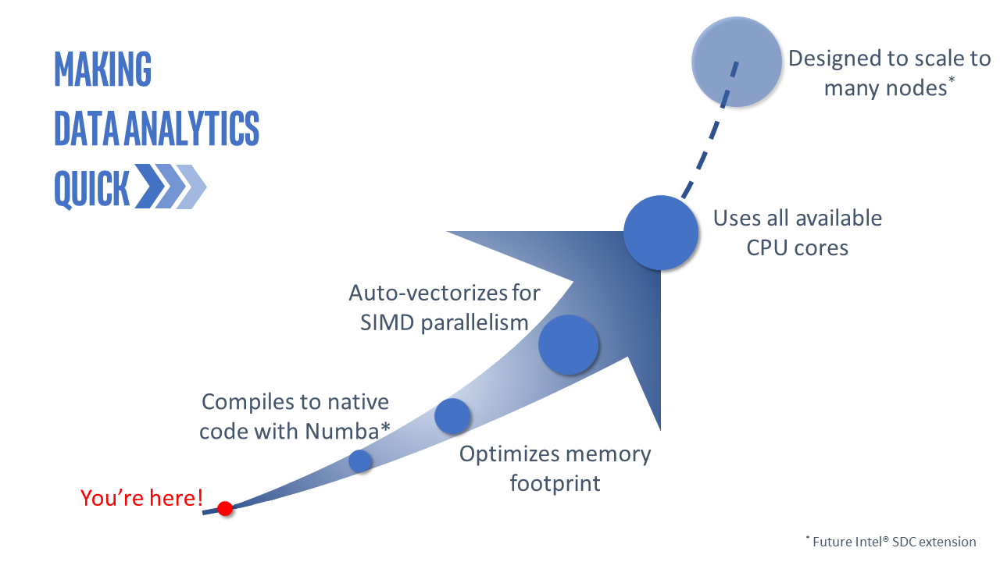

.. _index:
.. include:: ./ext_links.txt

.. image:: ./_images/intel_sdc_large_logo.png
    :width: 800px
    :align: center
    :alt: Intel® Scalable Dataframe Compiler

This is Intel® Scalable Dataframe Compiler (Intel® SDC), which is an extension of `Numba*`_ that enables compilation of
`Pandas*`_ operations. It automatically vectorizes and parallelizes the code by leveraging modern hardware instructions
and by utilizing all available cores.

User Manual
===========

.. toctree::
   :maxdepth: 2

   overview
   getting_started
   compilation
   performance
   workflow
   apireference
   examples
   for_developers
   other_intel_python_projects

Indices and tables
==================

* :ref:`genindex`
* :ref:`modindex`
* :ref:`search`

User Manual To-Do List
======================

.. todolist::
