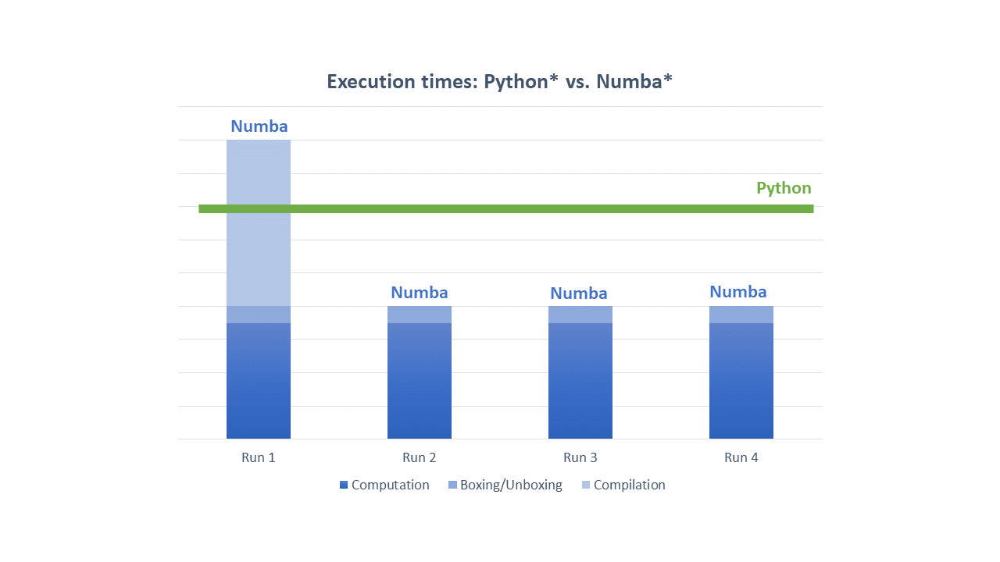

.. _performance:
.. include:: ./ext_links.txt

Getting Performance With Intel® SDC
===================================

Compiled code does not necessarily faster than interpreted one. There are several key elements impacting whether
compiled code will outperform an interpreted one or not. These are compilation overheads, overheads related to
converting Python objects to native structures and back, amount of parallelism in compiled code, to what extent
the code is "static", and many other factors. The following section will discuss each of these aspects in greater
detail.

Compilation Overheads
---------------------
Compilation of the code may lead to significantly better performance, however, it comes with some costs. First, there
is a cost associated with the need to compile a code. Depending on the size of compiled function and many other factors
the compilation time may be material.

With above in mind there are several general recommendations when using Intel SDC will be beneficial.

1. Compile application hotspots only.
    * Focus on where application spends most time.

2. Compile parts of the code where parallelism resides.
    * Remember that Intel SDC has been created
      to extract parallelism. If there is no parallelism in the code, then it unlikely to perform visibly better than
      interpreted code.

3. Compilation overheads quickly become negligible when compiled function is called multiple times.
    * If arguments to compiled function are type stable then `Numba*`_ won't recompile the function on each call.

4. Use `Numba* caching <https://numba.pydata.org/numba-doc/dev/developer/caching.html>`_ for ahead-of-time compilation.

5. Minimize the number of columns in dataframes in a region being compiled.
    * Intel SDC performs dataframe analysis at
      compilation time, as a result the compilation may take significantly longer if the number of columns is large.
      Among key features to reduce the number of columns in compile time analysis is to read in memory only columns
      actually used in computations.

Boxing And Unboxing Overheads
-----------------------------
All `Python*`_ objects are accessed through GIL, the Global Interpreter Lock, a mutex that protects Python objects
preventing multiple threads from executing bytecodes concurrently. While it is okay technology for interpreted code
it kills any sort of parallelism. For Intel SDC and `Numba*`_ to be able to extract parallelism, the GIL must be
released. To release GIL Python objects must be converted into native structures that do not require GIL.
The implication is additional overheads to convert input arguments into native objects (unboxing) and to
convert results back to Python objects (boxing).

In most cases these overheads are reasonably small as Intel SDC and Numba try to avoid extensive memory copy during
boxing and unboxing. However, sometimes memory copy is unavoidable, and passing large dataframe as input or as
a returning value may be expensive.

It is almost always a good idea to originate large amounts of data from within compiled region. For example,
reading large CSV file from outside compiled region and then passing that large dataframe as input may result in
visible unboxing costs.

The rule of thumb is "Generate and process massive data from within the compiled region. Pass through JIT region
borders small data only".

Automatic Parallelization
-------------------------
Intel SDC parallelizes most of `Pandas*`_ operations so that users do not typically
need to take extra steps besides using ``@njit`` decorator. However, sometimes you might want to extract additional
parallelism available in a JIT-region. To do that you need to add ``parallel=True`` option to ``@njit`` decorator:

.. literalinclude:: ../../examples/basic_workflow_parallel.py
   :language: python
   :emphasize-lines: 9-10
   :lines: 27-
   :caption: Example 2: Parallelizing `Pandas*`_ Workflow
   :name: ex_basic_workflow_parallel

Other Performance Tips
----------------------
Please refer to `Numba Performance Tips<https://numba.pydata.org/numba-doc/dev/user/performance-tips.html>`_
for additional hints on obtaining good performance with Intel SDC.
